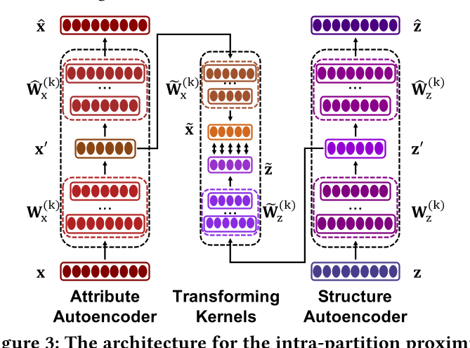

## Introduction

In principle, there are **two key observations** that lie at the core of bipartite attributed network embedding:

1. Inter-partition: It captures the across-partition relationships coveyed by the edges of bipartite networks.
2. Intra-partition: It consists of both **structure** and **attribute** aspects for nodes within the same partition. Nodes have similar "inter-action" behaviors with the nodes in the other partition should have high proximity.

BiANE simultaneously models the inter-partition proximity and the intra-partition proximity of the network and integrates each other to ameliorate the learning result. Also, it introduce an efficient **dynamic positive sampling strategy**, which improves the training result and makes our model scalable for large scale networks.

## Methods

### Notations

|                       Notations                       |                 Definition                  |
| :---------------------------------------------------: | :-----------------------------------------: |
|         $\textbf W_x^{(k)},\textbf W_z^{(k)}$         |             encoder parameters              |
|   $\hat{\textbf W}_x^{(k)},\hat{\textbf W}_z^{(k)}$   |             decoder parameters              |
| $\tilde{\textbf W}_x^{(k)},\tilde{\textbf W}_z^{(k)}$ |       transforming kernel parameters        |
|                 $\textbf x,\textbf z$                 | attribute and high-order structure features |
|           $\hat{\textbf x},\hat{\textbf z}$           |            reconstructed vectors            |
|                $\textbf x',\textbf z'$                |            autoencoder encodings            |
|         $\tilde{\textbf x},\tilde{\textbf z}$         |           latent representations            |
|                      $\textbf h$                      |              final embeddings               |

### Framework

#### View

First, we generate an **intra interaction diagram** based on the inter interaction view. Specifically, if nodes $u_1$ and $u_2$ in the same side are simultaneously connected to $v$ in another side, then $u_1$ and $u_2$ are connected in the generated intra interaction diagram. In this way, we obtain the **inter interaction view** of $u$ and $v$. Then we put the structure **embeddings and feature embeddings** $\textbf x$ and $\textbf z$ in the graph through the autoencoder respectively to get the **encoded embeedings** $\textbf x'$ and $\textbf z'$ and the **reconstructed embeddings** $\hat{\textbf x}$ and $\hat{\textbf z}$. And we use **encoded embeedings** $\textbf x',\textbf z'$ to get the **latent representations embeedings** $\tilde{\textbf x}, \tilde{\textbf z}$.

First we reduce the difference between the **initial embeddings** and the **refactoring embeddings**, doing this separately for $\textbf x,\hat{\textbf x}$ and $\textbf z,\hat{\textbf z}$. We then reduce the difference between the **two encoded embeddings** $\textbf x_m',\textbf x_n'$ if there is an edge between the two points $m,n$. Finally, we reduce the difference of  **two latent representations embeedings**  $\tilde{\textbf x}_m,\tilde{\textbf z}_n$ for $m=n$ or the **dynamic positive sampling distribution** $m,n$. Finally, we concatenate $\textbf x′$ and $\textbf z′$ to obtain the **final embedding** $\textbf h$ and utilize it for the **inter-partition proximity modeling**.

#### Intra-Partition Proximity Modeling

We get the **embeddings of the features** according to the features of the nodes, and then we get the **embeddings of the structures** by accumulating the $k$​​ power of the **adjacency matrix** of the **interaction graph** within the group.


$$
\textbf Z=\textbf A^1+\textbf A^2+...+\textbf A^{k-1}+\textbf A^k
$$


We then feed these two embeddings into the **autoencoder** to **minimize the reconstruction loss** of the autoencoder:
$$
L_2=\sum_i\Vert \tilde{\textbf x}_i-\textbf x_i\Vert^2+\sum_i\Vert \tilde{\textbf z}_i-\textbf z_i\Vert^2
$$
We then reduce the difference between the **two encoded embeddings** $\textbf x_m',\textbf x_n'$ if there is an edge between the two points $m,n$​​.


$$
L_3=-\sum_{a_{mn}>0}\log\sigma(\textbf x_m'^\intercal \cdot \textbf x_n')-\sum_{n'=1}\mathbb{E}_{v_{n'}\sim P_n'(v)}\log\sigma(-\textbf x_m'^\intercal \cdot \textbf x_{n'}')\newline -\sum_{a_{mn}>0}\log\sigma(\textbf z_m'^\intercal \cdot \textbf z_n')-\sum_{n'=1}\mathbb{E}_{v_{n'}\sim P_n'(v)}\log\sigma(-\textbf z_m'^\intercal \cdot \textbf z_{n'}')
$$



We employ two auxiliary space transforming kernels to switch the space from encodings to a new latent space and project the encodings to latent representations:


$$
\tilde{\textbf x}=\delta^{(k)}(\tilde{\textbf W}_x^{(k)}(...\delta^{(1)}(\tilde{\textbf W}_x^{(1)}\textbf x'+\tilde{\textbf b}_x^{(1)})...)+\tilde{\textbf b}_x^{(k)}) \newline \tilde{\textbf z}=\delta^{(k)}(\tilde{\textbf W}_z^{(k)}(...\delta^{(1)}(\tilde{\textbf W}_z^{(1)}\textbf z'+\tilde{\textbf b}_z^{(1)})...)+\tilde{\textbf b}_z^{(k)})
$$


We define the **correlation** between the attribute information and the structure information for any two nodes as the joint probability of their latent representations:


$$
\tilde p(m,n)=\sigma(\tilde{\textbf{x}}_m^\intercal \cdot \tilde{\textbf{z}}_n)
$$


And we **maximize** the **joint probability** of its own $\tilde{\textbf x}$ and $\tilde{\textbf z}$​​ in the new latent space:


$$
L_4=-\sum_{m=n}\log\sigma(\tilde{\textbf{x}}_m^\intercal \cdot \tilde{\textbf{z}}_n)-\sum_{n'=1}\mathbb{E}_{v_n'\sim P_n'(v)}\log\sigma(-\tilde{\textbf{x}}_m^\intercal \cdot \tilde{\textbf{z}}_n')
$$


Finally we propose a **novel dynamic positive sampling strategy** and combine it with **static negative sampling** for loss function $L_4$. We employ $\text{HNSW}$ for constructing indexes to achieve efficient dynamic positive sampling.


$$
L_4=-\sum_{m=n~or~u_m,u_n\sim \tilde{p}(m,n)}\log\sigma(\tilde{\textbf{x}}_m^\intercal \cdot \tilde{\textbf{z}}_n)-\sum_{n'=1}\mathbb{E}_{v_n'\sim P_n'(v)}\log\sigma(-\tilde{\textbf{x}}_m^\intercal \cdot \tilde{\textbf{z}}_n')
$$


#### Inter-Partition Proximity Modeling

For an edge $e_{mn}$ between $u_m$ and $v_n$​​, we regard their joint probability as the inter-partition proximity between them:



$$
p(m,n)=\sigma(\textbf{h}_m^\intercal \cdot \textbf{h}_n)
$$


We can to minimizing the difference of their final embeddings, so we get loss function:


$$
L_1=\sum_{e_{mn}\in \mathcal{E}}\log\sigma(\textbf{h}_m^\intercal \cdot \textbf h_n)-\sum_{n'=1}\mathbb{E}_{v_n'\sim p_n(v)}\log\sigma(-\textbf{h}_m^\intercal \cdot \textbf h_{n'})
$$


where $P_n(v)$ is the negative sampling distribution.
