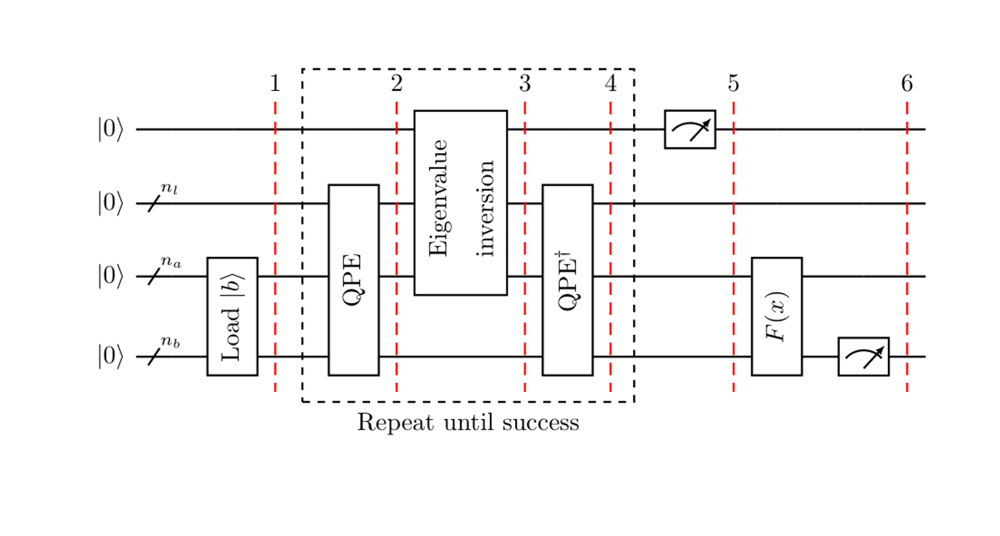

# **Linear Systems of Equations**

The problem can be defined as, given a matrix $A\in\mathbb{C}^{N\times N}$ and a vector $\vec{b}\in\mathbb{C}^{N}$,find $\vec{x}\in\mathbb{C}^{N}$ satisfying $A\vec{x}=\vec{b}$.

# Condition

The given linear system has to have a low condition number ${\displaystyle \kappa }$, and the Matrix $A$ must be $s$-sparse.

This means $A$ must have at most $s$ non-zero entries per row or column.

To solve an $s$-sparse problem of size $N$ with a classical computer requires $\mathcal{ O }(Ns\kappa\log(1/\epsilon))$ running time using the conjugate gradient method, here $\epsilon$ Indicates accuracy of approximation. The HHL can approximates a function of the solution vector of a linear system of equations, with running time complexity of $\mathcal{ O }(\log(N)s^{2}\kappa^{2}/\epsilon)$.

Matrix $A$ should be Hermitian so that it can be converted into a unitary operator.

# Some M**athematical Background**

We assume $\vec{b}$ and $\vec{x}$ to be normalized and map them to the respective quantum states $|b\rangle$ and $|x\rangle$.

Usually, the $i^{th}$ component of $\vec{b}$ (resp. $x$) corresponds to the amplitude of the $i^{th}$ basis state of the quantum state $|b\rangle$(resp. $|x\rangle$).

So the problem becomes

$$
A|x\rangle=|b\rangle
$$

Since $A$ is Hermitian, it has a spectral decomposition

$$
A=\sum_{j=0}^{N-1}\lambda_{j}|u_{j}\rangle\langle u_{j}|,\quad \lambda_{j}\in\mathbb{ R }
$$

$|u_j\rangle$ is the $j^{th}$ eigenvector of $A$ with respective eigenvalue $\lambda_j$. Similarly, we have

$$
A^{-1}=\sum_{j=0}^{N-1}\lambda_{j}^{-1}|u_{j}\rangle\langle u_{j}|
$$

Since $A$ is invertible and Hermitian, it must have an orthogonal basis of eigenvectors, and thus we can write $b$ in the eigen basis of $A$ as

$$
|b\rangle=\sum_{j=0}^{N-1}b_{j}|u_{j}\rangle,\quad b_{j}\in\mathbb{ C }
$$

The HHL algorithm ends when the following equation is satisfied

$$
|x\rangle=A^{-1}|b\rangle=\sum_{j=0}^{N-1}\lambda_{j}^{-1}b_{j}|u_{j}\rangle
$$

Note that here we already have an implicit normalization constant since we are talking about a quantum state.

# **Description**

## Basic Introduction

The algorithm uses three quantum registers, all of them set to $|0\rangle$ at the beginning of the algorithm.

- $n_l$: used to store a binary representation of the eigenvalues of $A$.
- $n_b$: used to contains the vector solution, we assume that $N=2^{n_b}$.
- $n_a$: an extra register, for the auxiliary qubits, used as intermediate steps in the individual computations.

We ignored $n_a$ because since they are set to $|0\rangle$ at the beginning of each computation and restored back to the $|0\rangle$ state at the end of the individual operation.

The following is a corresponding circuit.

The following is an outline of the HHL algorithm

1. Load the data $|b\rangle\in\mathbb{ C }^{N}$. That is, perform the transformation

$$|0\rangle _{n_b} \mapsto |b\rangle _{n_b}$$
    
2. Apply Quantum Phase Estimation (QPE) with


$$ U = e ^ { i A t } := \sum _{j=0}^{N-1}e ^ { i \lambda _ { j } t } |u_{j}\rangle\langle u_{j}| $$


The quantum state of the register expressed in the eigen basis of $A$ is now

$$
\sum_{j=0}^{N-1} b _ { j } |\lambda _ {j }\rangle_{n_{l}} |u_{j}\rangle_{n_{b}}
$$

$|\lambda _ {j }\rangle_{n_{l}}$ is the $n_l$-bit binary representation of $\lambda_j$.

1. Add an auxiliary qubit and apply a rotation conditioned on $|\lambda_{ j }\rangle$,

$$
\sum_{j=0}^{N-1} b _ { j } |\lambda _ { j }\rangle_{n_{l}}|u_{j}\rangle_{n_{b}} \left( \sqrt { 1 - \frac { C^{2}  } { \lambda _ { j } ^ { 2 } } } |0\rangle + \frac { C } { \lambda _ { j } } |1\rangle \right)
$$

$C$ is a normalization constant satisfies $|C| < \lambda_{min}$, $\lambda_{min}$ presents the smallest eigenvalue.

1. Apply QPE$^{\dagger}$. Ignoring possible errors from QPE, this results in

$$
\sum_{j=0}^{N-1} b _ { j } |0\rangle_{n_{l}}|u_{j}\rangle_{n_{b}} \left( \sqrt { 1 - \frac {C^{2}  } { \lambda _ { j } ^ { 2 } } } |0\rangle + \frac { C } { \lambda _ { j } } |1\rangle \right)
$$

1. Measure the auxiliary qubit in the computational basis. If the outcome is $1$, the register is in the post-measurement state.


$$
\left( \sqrt { \frac { 1 } { \sum_{j=0}^{N-1} \left| b _ { j } \right| ^ { 2 } / \left| \lambda _ { j } \right| ^ { 2 } } } \right) \sum _{j=0}^{N-1} \frac{b _ { j }}{\lambda _ { j }} |0\rangle_{n_{l}}|u_{j}\rangle_{n_{b}}
$$


which up to a normalization factor corresponds to the solution.

1. Apply an observable $M$ to calculate $F(x):=\langle x|M|x\rangle$.

## Additional notes on QPE

In the second step above, we used QPE for the conversion, and here are some details about it

The QPE algorithm, takes as inputs the unitary gate for $U$ and the state $|0\rangle_{n}|\psi\rangle_{m}$ and return the state $|\tilde{\theta}\rangle_{n}|\psi\rangle_{m}$.

Here $\tilde{\theta}$ denotes a binary approximation to $2^n\theta$ and the $n$ subscript denotes it has been truncated to $n$ digits.

$$
\operatorname { QPE } ( U , |0\rangle_{n}|\psi\rangle_{m} ) = |\tilde{\theta}\rangle_{n}|\psi\rangle_{m}
$$

And we apply to the second step, apparently getting

$$
\operatorname { QPE } ( e ^ { i A t } , \sum_{j=0}^{N-1}b_{j}|0\rangle_{n_{l}}|u_{j}\rangle_{n_{b}} ) = \sum_{j=0}^{N-1}b_{j}|\lambda_{j}\rangle_{n_{l}}|u_{j}\rangle_{n_{b}}
$$