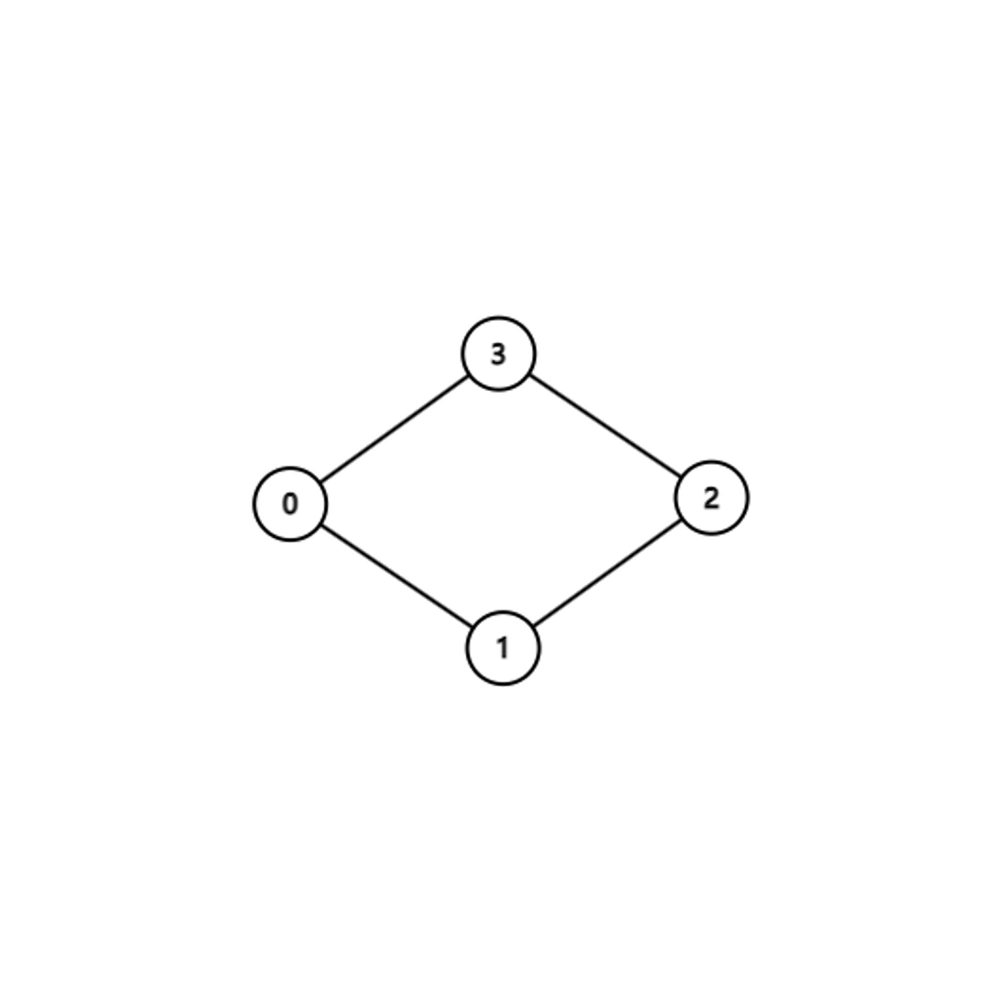
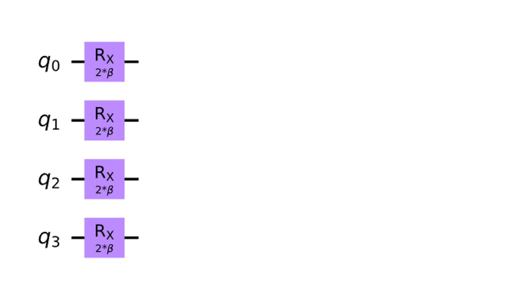
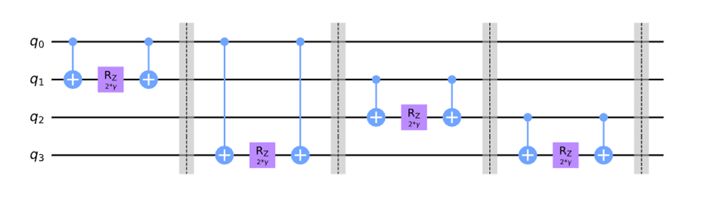
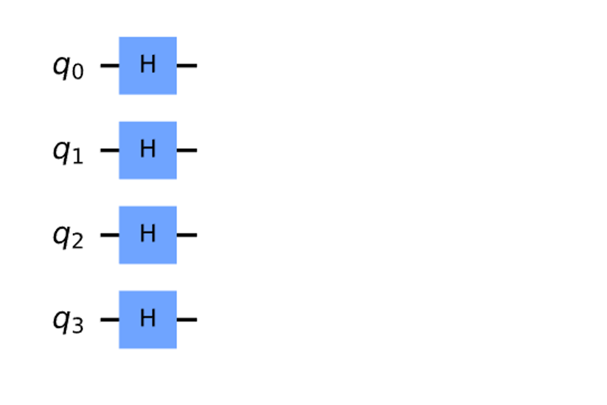
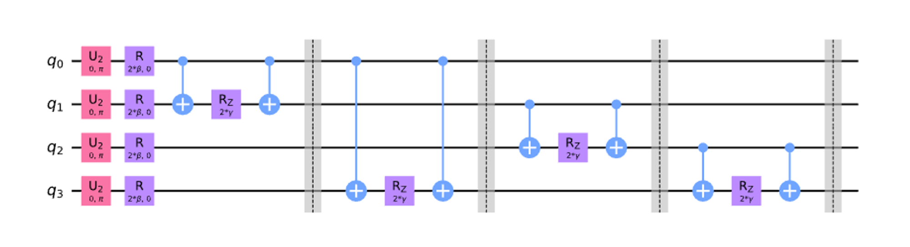
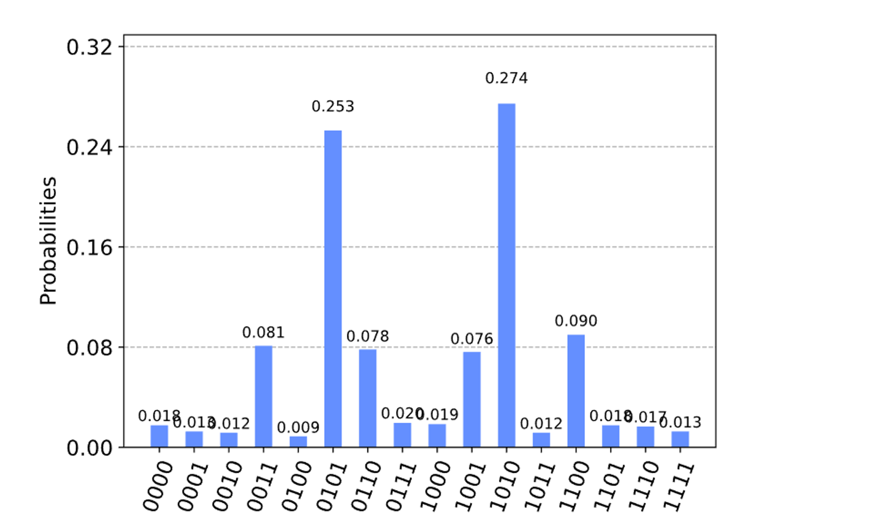

# Max-Cut Problem

A type of Max-Cut Problem involves partitioning nodes of a graph into two sets, such that the number of edges between the sets is maximum.

# Definition

QAOA is a quantum algorithm that attempts to solve such combinatorial problems.

# Content

QAOA uses unitary $U(\beta,\gamma)$ to prepare a quantum state $|\psi(\beta,\gamma)\rangle$ , the goal of the algorithm is to find optimal parameters $(\beta_{opt},\gamma_{opt})$ such that the quantum state $|\psi(\beta_{opt},\gamma_{opt})\rangle$ encodes the solution to the problem.

Unitary $U(\beta,\gamma)$ is composed of $U(\beta)=e^{-i\beta H_B}$ and $U(\gamma)=e^{-i\gamma H_P}$ where $H_B$ is the mixing Hamiltonian and $H_P$ is the problem Hamiltonian.

More specifically, the process can be expressed as follows:

$$
|\psi(\beta,\gamma)\rangle =\underbrace{U(\beta)U(\gamma)...U(\beta)U(\gamma)}_{p~ times}|\psi_0\rangle
$$

The state is prepared by applying these unitary as alternating blocks of the two unitary applied $p$ times where $|\psi_0\rangle$ is a suitable initial state.

# QAOA Algorithm to Solve the Max-Cut Problem

## **The Mixing Unitary and The Problem Unitary**

The problem Hamiltonian specific to the Max-Cut problem up to a constant here is:

$$
H_P = \frac{1}{2}\big(Z_0 \otimes Z_1 \otimes I_2 \otimes I_3\big) + 
        \frac{1}{2}\big(I_0 \otimes Z_1 \otimes Z_2 \otimes I_3\big) +
        \frac{1}{2}\big(Z_0 \otimes I_1 \otimes I_2 \otimes Z_3\big) +
        \frac{1}{2}\big(I_0 \otimes I_1 \otimes Z_2 \otimes Z_3\big)
$$

The mixer Hamiltonian $H_B$ is usually of the form:

$$
H_B = \big(X_0 \otimes I_1 \otimes I_2 \otimes I_3 \big) + 
      \big(I_0 \otimes X_1 \otimes I_2 \otimes I_3 \big) +
      \big(I_0 \otimes I_1 \otimes X_2 \otimes I_3 \big) +
      \big(I_0 \otimes I_1 \otimes I_2 \otimes X_3 \big)
$$

We can write the unitary as:

$$
U(H_B) = e^{-i \beta H_B} = e^{-i \beta X_0}e^{-i \beta X_1}e^{-i \beta X_2}e^{-i \beta X_3}.
$$

$$
U(H_P) = e^{-i \gamma H_P} = e^{-i \gamma Z_0 Z_1}e^{-i \gamma Z_1 Z_2}e^{-i \gamma Z_2 Z_3}e^{-i \gamma Z_0 Z_3}
$$

The circuits of the two unitary look like:

**The Mixing Unitary**

**The Problem Unitary**

## **The Initial State**

The initial state used during QAOA is usually an equal superposition of all the basis states i.e.

$$
\lvert \psi_0 \rangle = \bigg(\frac{1}{\sqrt{2}}\big(\lvert 0 \rangle + \lvert 1 \rangle\big)\bigg)^{\otimes n}
$$

When the number of qubits is 4 $(n=4)$, can be prepared by applying Hadamard gates starting from an all zero state:

## The **QAOA circuit**

Through the approaches mentioned above, we can get the steps of the QAOA:

- Preparing an initial state
- Applying the unitary $U(H_P)$ corresponding to the problem Hamiltonian
- Applying the mixing unitary $U(H_B)$

The circuit is as follows:

The U-gate with parameters $(\frac{\pi}{2},0,\pi)$ is equal to the Hadamard Gate.

## Find the optimal parameters

The goal of the QAOA algorithm is to minimize the expectation value of 

$$\langle \psi(\boldsymbol{\beta}_{opt}, \boldsymbol{\gamma}_{opt}) \rvert H_P \lvert \psi(\boldsymbol{\beta}_{opt}, \boldsymbol{\gamma}_{opt}) \rangle$$ 
Such an expectation can be obtained by doing measurement in the Z-basis. And we use a classical optimization algorithm to find the optimal parameters.


The steps can be present as follows:

1. Initialize $\beta$ and $\gamma$ to suitable real values.
2. Repeat until some suitable convergence criteria is met:
    1. Prepare the state $|\psi(\beta,\gamma)\rangle$ using QAOA circuit.
    2. Measure the state in the Z-basis.
    3. Compute $\langle \psi(\boldsymbol{\beta}, \boldsymbol{\gamma}) \rvert H_P \lvert \psi(\boldsymbol{\beta}, \boldsymbol{\gamma}) \rangle$
    4. Find new set of parameters $(\beta_{new},\gamma_{new})$ using a classical optimization algorithm
    5. Reset the parameters $(\beta,\gamma)$ to $(\beta_{new},\gamma_{new})$

## **Analyzing the result**

After performing the steps above, we can get the probabilities of all states i.e.

And we notice that the answer $0101$ and $1010$ have the highest probability, obviously they are suitable answers.