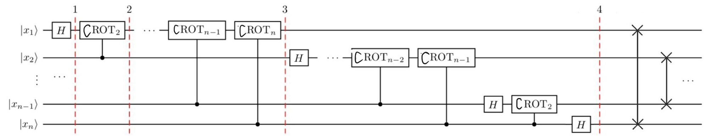

# Mathematical forms

Use the $N$ orthogonally normalized states $|0\rang,|1\rang,...,|N-1\rang$ as bases for the Hilbert space, QFT transforms any of the bases $|j\rang$ into

$$\frac{1}{\sqrt{N}}\sum_{k=0}^{N-1}\omega_N^{jk} \vert k \rangle $$

where $\omega_N^{jk} = e^{2\pi i \frac{jk}{N}}$.

In effect, the QFT transform changes each base state vector into a superposition of all base states by a factor of $\frac{1}{\sqrt{N}}\omega_N^{jk}$.

More generally, apply the QFT operation to any state vector $|\psi \rang$ in that space

$$
QFT(|\psi\rang)=\sum_jx_jQFT(|j\rang)=\sum_jx_j\left( \frac{1}{\sqrt{N}}\sum_k\omega_N^{jk} \vert k \rangle \right) \newline =\sum_k\left( \sum_j \frac{x_j}{\sqrt{N}}\omega_N^{jk}\right) \vert k \rangle =\sum_k y_k|k\rang
$$

$$
y_k=\frac{1}{\sqrt{N}}\sum_j x_j\omega_N^{jk}
$$

So QFT is equivalent to a DFT operation on the probability magnitudes $\{x_j\}$ of a state vector on the base to obtain a new set of probability magnitudes $\{y_j\}$.

# Formal simplification

To implement this for each quantum bit, we simplify the original equation according to the following rules

- If there are $N$ orthogonally normalized states as bases, we assume that $N=2^n$, then the physical system has $n$ quantum bits.
- We change the representation of the substrate to binary, for example

$$
|0\rang \rightarrow |000...00\rang,|1\rang \rightarrow |000...01\rang,|N-1\rang \rightarrow |111...11\rang
$$

- We represent the $k$ on the index as $k=k_12^{n-1}+k_22^{n-2}+...k_n2^0$.

$$
\frac{1}{\sqrt{N}}\sum_{k=0}^{N-1}\omega_N^{jk} \vert k \rangle= \frac{1}{\sqrt{N}}\sum_{k=0}^{N-1}e^{2\pi i \frac{jk}{N}} \vert k \rangle \newline=\frac{1}{\sqrt{2^n}}\sum_{k_1=0}^1 \sum_{k_2=0}^1 ... \sum_{k_n=0}^1e^{i\frac{2\pi}{2^n}j(k_12^{n-1}+k_22^{n-2}+...k_n2^0)}|k_1k_2...k_n\rang \newline =\frac{1}{\sqrt{2^n}}\sum_{k_1=0}^1 \sum_{k_2=0}^1 ... \sum_{k_n=0}^1e^{2\pi ij(k_12^{-1}+k_22^{-2}+...k_n2^{-n})}|k_1k_2...k_n\rang \newline  =\frac{1}{\sqrt{2^n}}\sum_{k_1=0}^1 \sum_{k_2=0}^1 ... \sum_{k_n=0}^1 e^{2\pi i j(k_12^{-1})}|k_1\rang \otimes e^{2\pi i j(k_22^{-2})}|k_2\rang \otimes ... \otimes e^{2\pi i j(k_n2^{-n})}|k_n\rang
$$

Changing the sum and product order

$$
\bigotimes_{l=1}^n\frac{|0\rang+e^{2\pi i j2^{-l}}|1\rang}{\sqrt{2}}
$$

where $j2^{-l}=\frac{j_12^{n-1}+j_22^{n-2}+...+j_n2^0}{2^l}$, because of the periodicity of $e^{2\pi i}$, we can ignore the integer part

$$
\bigotimes_{l=1}^n\frac{|0\rang+e^{2\pi i j2^{-l}}|1\rang}{\sqrt{2}}=\frac{|0\rang+e^{2\pi i (j_n2^0)2^{-1}}|1\rang}{\sqrt{2}}\otimes \frac{|0\rang+e^{2\pi i (j_{n-1}2^1+j_n2^0)2^{-2}}|1\rang}{\sqrt{2}}\otimes ...
$$

# Constructing quantum lines

## A Problem

We list the transformation equation

$$
|j_1\rang\rightarrow \frac{|0\rang+e^{2\pi i 0.j_n}|1\rang}{\sqrt{2}} \newline ... \newline|j_n\rang\rightarrow \frac{|0\rang+e^{2\pi i 0.j_1j_2...j_n}|1\rang}{\sqrt{2}}
$$

Here we represent the fractional part as $0.j_1j_2...j_n$.

We find that the transformation of both involves the other, so there is no one legitimate sequence of transformations.

## Solution

To solve this problem, we can reverse the state of the qubits, specifically

$$
|j_1\rang\rightarrow \frac{|0\rang+e^{2\pi i 0.j_1j_2...j_n}|1\rang}{\sqrt{2}}  \newline |j_2\rang\rightarrow \frac{|0\rang+e^{2\pi i 0.j_2...j_n}|1\rang}{\sqrt{2}} \newline ... \newline|j_n\rang\rightarrow \frac{|0\rang+e^{2\pi i 0.j_n}|1\rang}{\sqrt{2}}
$$

We put $j_1$ in the state of $j_n$, $j_n$ in the state of $j_1$, $j_2$ in the state of  $j_{n-1}$, and so on.

Finally we just reverse it back through a number of swap gates.

## Circuit

Let's use $j_1$ as an example, first we apply the Hadamard gate

$$
|j_1\rang =|0\rang \rightarrow \frac{|0\rang+e^{2\pi i (\frac{j_1}{2})}|1\rang}{\sqrt{2}}
$$

And we apply the $CROT_2$ gate

$$
CROT_2=\begin{gathered}
\begin{bmatrix}I & 0 \newline 0  & UROT_2\end{bmatrix}
\end{gathered}\newline UROT_2=\begin{gathered}
\begin{bmatrix} 1 & 0 \newline 0  & exp(\frac{2\pi i}{2^2})\end{bmatrix}
\end{gathered}
$$

which means do noting when $j_2=0$, apply the gate $UROT_2$ when $j_2=1$, and we get

$$
|j_1\rang =\frac{|0\rang+e^{2\pi i (\frac{j_1}{2}+\frac{j_2}{2^2})}|1\rang}{\sqrt{2}}
$$

By applying the following $CROT_k$ gate

$$
CROT_k=\begin{gathered}
\begin{bmatrix}I & 0 \newline 0  & UROT_k\end{bmatrix}
\end{gathered}\newline UROT_k=\begin{gathered}
\begin{bmatrix} 1 & 0 \newline 0  & exp(\frac{2\pi i}{2^k})\end{bmatrix}
\end{gathered}
$$

Finally we get

$$
|j_1\rang =\frac{|0\rang+e^{2\pi i (\frac{j_1}{2}+\frac{j_2}{2^2}+...+\frac{j_n}{2^n})}|1\rang}{\sqrt{2}}
$$

And we apply the similar operation to the remaining quantum bits.

Circuit diagram of the QFT is shown below

