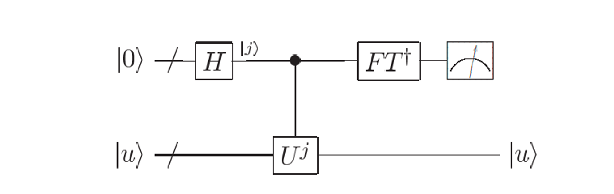
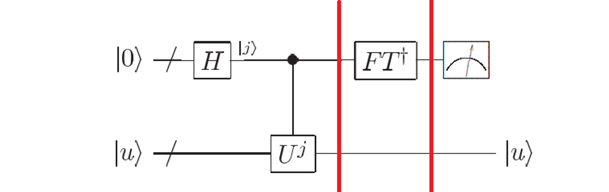
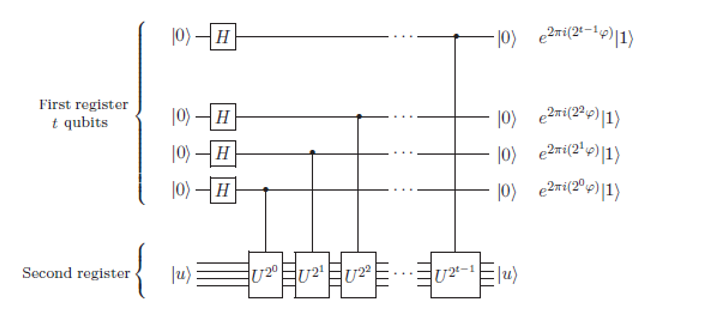
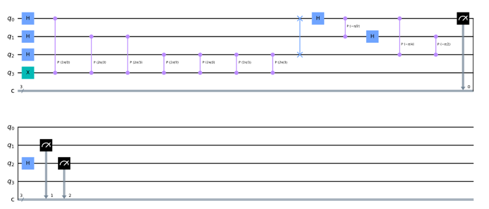

# Introduction

Suppose a unitary operator $U$ has an eigenvector $|u\rang$ with eigenvalue $e^{2\pi i \varphi}$, where the value of $\varphi$ is unknown. The goal of the phase estimation algorithm is to estimate $\varphi$ i.e.

$$
U|u\rang=e^{2\pi i\varphi}|u\rang
$$

Considering the periodicity of $e^{2\pi i\varphi}$, we have $0 \leq \varphi <1$.

In the Fourier transform, we convert the state vector information of $|j\rang$ to the phase of each qubit

$$
|j\rang \rightarrow \frac{|0\rang+e^{2\pi i 0.j_n}|1\rang}{\sqrt{2}}\otimes \frac{|0\rang+e^{2\pi i 0.j_{n-1}j_n}|1\rang}{\sqrt{2}}\otimes ...
$$

For the sake of brevity, we will call this state the QFT state.

So on the contrary, by applying the Quantum Fourier Inversion to the phase state, we can translate the information of the phase to the state vector, and the substrate can then be measured.

# Constructing quantum lines

## Overview

The approximate circuit diagram for Phase Estimation is shown below

We can divide it into three parts

- Encoding of phase $\varphi$ onto QFT state.
- Apply the Quantum Fourier Inversion.
- A measurement in the computational basis therefore gives us $\varphi$ exactly.

## Stage1

We prepare two sets of qubits, forming two registers of quantum states

**Register1:** There are a total of $t$ qubits to store the phase $\varphi$. The choice of $t$ is related to the accuracy requirement, the larger the $t$, the higher the permissible accuracy of the phase estimation.

**Register2:** For carrying the $U$ eigenstate $|u\rang$, prepared at the beginning as $|u\rang$.

The quantum circuit diagram is shown below

We apply Hadamard gate to each of the $t$ qubits at first

$$
\frac{|0\rang+|1\rang}{\sqrt{2}}\otimes \frac{|0\rang+|1\rang}{\sqrt{2}}\otimes ...\otimes \frac{|0\rang+|1\rang}{\sqrt{2}}\otimes |u\rang
$$

Next, we take each qubit in **Register1** in turn as a control bit and execute $U^{2^{t-l}}$ (perform $U$ operator $2^{t-l}$ times) on **Register2**

$$
\frac{|0\rang+e^{2\pi i2^{t-1}\varphi}|1\rang}{\sqrt{2}}\otimes \frac{|0\rang+e^{2\pi i2^{t-2}\varphi}|1\rang}{\sqrt{2}}\otimes ...\otimes \frac{|0\rang+e^{2\pi i2^{0}\varphi}|1\rang}{\sqrt{2}}\otimes |u\rang \newline =\frac{1}{\sqrt{2^t}}\sum_{k=0}^{2^t-1}e^{2\pi ik\varphi}|k\rang
$$

Previously mentioned $0\leq \varphi <1$, we suppose that $\varphi=0.\varphi_1\varphi_2\varphi_3...\varphi_n$, we take $t=n$ and $\varphi=\varphi_12^{-1}+\varphi_22^{-2}+...+\varphi_t2^{-t}$ under ideal conditions, i.e. no errors in Phase Estimation.

We substitute $\varphi=\varphi_12^{-1}+\varphi_22^{-2}+...+\varphi_t2^{-t}$ into the above equation and found that we obtained the QFT state we wanted to prepare

$$
\frac{|0\rang+e^{2\pi i0.\varphi_t}|1\rang}{\sqrt{2}}\otimes \frac{|0\rang+e^{2\pi i0.\varphi_{t-1}\varphi_t}|1\rang}{\sqrt{2}}\otimes ...\otimes \frac{|0\rang+e^{2\pi i0.\varphi_{1}\varphi_{2}...\varphi_t}|1\rang}{\sqrt{2}}\otimes |u\rang \newline =\frac{1}{\sqrt{2^t}}\sum_{k=0}^{2^t-1}e^{2\pi ik\varphi}|k\rang
$$

And we perform the Quantum Fourier Inversion to get $|\varphi_1\varphi_2...\varphi_t\rang$.

## Stage2

About the Quantum Fourier Inversion, we simply apply the inversion of each gate in the QFT in reverse order.

For example, on the condition that $t=3$, the circuit are as follows

## Stage3

As shown above, we end up with measurements for $t$ quantum bits, multiplying the weighted values by the probabilities to arrive at an estimate of $\varphi$.