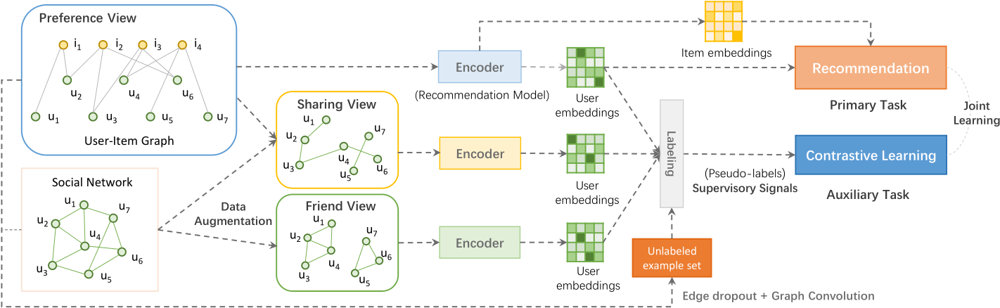

## Introduction

Most existing SSL-based methods perturb the raw data graph with uniform node/edge dropout to generate new data views and use two views for Contrastive Learning. In this case, the node $u$, it only has $u'$ as its positive example in the other view, many self-supervised signals from other nodes are lost. 

In this paper, the author uses a combination of a **Social Network Graph** and a **User-Item Interaction Graph** to generate two auxiliary views for labeling the positive examples of a node, thus enhancing contrastive learning.

## Preknowledge

### Graph Contrastive Learning

By randomly enhancing the original graph, maximizing the consistency of the same node representation in different views, and minimizing the consistency of different node representations in different views.

## Methods

### Preliminaries

|                           Name                           |                            Signal                            |
| :------------------------------------------------------: | :----------------------------------------------------------: |
|               User-Item Interaction Graph                |                       $\mathcal{G_r}$                        |
|                      Social Network                      |                       $\mathcal{G_s}$                        |
| User Nodes (both in $\mathcal{G_r}$ and $\mathcal{G_s}$) |              $\mathcal{U}=\{u_1,u_2,...,u_m\}$               |
|                        Item Nodes                        |              $\mathcal{I}=\{u_1,u_2,...,u_m\}$               |
|               User-Item Interaction Matrix               | $R\in \mathbb{R}^{m\times n}$, $r_{ui}=1$ indicates user $u$ has consumed/clicked item $i$, otherwise $r_{ui}=0$ |
|                  Social Network Matrix                   | $S\in \mathbb{S}^{m\times m}$, $s_{uv}=1$ indicates user $u$ has relations with the user $v$, the adjacency is symmetric |
|              Learned Final User Embeddings               | $P\in \mathbb{R}^{m\times d}$, $m$ users each has $d$ dimensions |
|              Learned Final Item Embeddings               | $Q\in \mathbb{R}^{n\times d}$, $n$ items each has $d$ dimensions |

### Views

The architecture diagram of the model is shown below:

First, we generate a **Friend View** from the social network graph. We use the $u_1-u_2-u_3$ tuple from the Social Network Graph. We keep only the triples $u_1-u_2-u_3$ that satisfy the properties of complete subgraphs, with the mathematical form as follows:
$$
A_f=(SS)\odot S
$$
Then, we generate a **Sharing View** from the User-Item Graph. We use the $u_1-i-u_2$ tuple from the User-Item Graph. If a triple satisfying this condition exists, then there is an edge between $u_1$ and $u_2$, with the mathematical form as follows:
$$
A_s=(RR^T)\odot S
$$

### Unlabeled Example Set

We perturb the raw graph with **Edge Dropout** at a certain probability $\rho$ to create a corrupted graph from where the learned user representations are used as the unlabeled examples. This process can be formulated as:
$$
\tilde{\mathcal{G}}=\left(\mathcal{N_r}\cup \mathcal{N_s},\textbf m\odot(\mathcal{E_r}\cup \mathcal{E_s}) \right)
$$
$\textbf{m}\in\{0,1\}^{|\mathcal{E_r}\cup \mathcal{E_s}|}$ is the mask vector to drop edges.

### Encoder

We adopt **LightGCN** as the basic structure for the model. We need three encoders to encode the **Preference View**, the **Sharing View**, and the **Friend View**.

The general form of encoders is defined as follows:
$$
Z=H(E,V)
$$
The encoder generates the final node representations $Z\in \mathbb{R}^{m\times d} ~\text{or}~\mathbb{R}^{(m+n)\times d}$ from the initial node embeddings $E$ and three views $\mathcal{V}\in\{R,A_s,A_f\}$.

The initial node embeddings $E$ are shared by the three encoders. We use the encoder for **Preference View** as the primary encoder for recommendation and the remaining two encoders as secondary encoders for marking positive and negative cases.

### Constructing Self-Supervision Signals

We label the perturbed graph $\tilde{\mathcal{G}}$ with positive and negative examples, assuming that the node we are currently considering is $u$. First, we generate the confidence probability of the two auxiliary views for this node, i.e.
$$
y_{u^+}^s=\text{Softmax}(\phi(\tilde{Z},z_u^s)),y_{u^+}^f=\text{Softmax}(\phi(\tilde{Z},z_u^f))
$$
$\tilde{Z}$ is the representations of users in the unlabeled example set obtained through graph convolution, $z_u^s$ and $z_u^f$ are the representations of the user $u$ learned by $H_s$ and $H_f$, respectively. We use cosine operation $\phi$ and Softmax operation to get the predicted probability $y_{u^+}^s,y_{u^+}^f$。

We then equalize the probabilistic prediction results for both views, i.e.
$$
y_{u+}^r=\frac{1}{2}(y_{u^+}^s+y_{u^+}^f)
$$
And we get $K$ top positive samples with the highest confidence as pseudo-labels. The process can be formulated as:

$$
\mathcal{P_{u+}^r}=\{\tilde{Z}_k|k\in \text{Top-}K(y_{u+}^r),\tilde{Z}\sim \tilde{\mathcal{G}}\}
$$


### Contrastive Learning

Then, we use the $K$ Pseudo-labels we get below for contrastive learning. Specifically, we treat these nodes as positive examples and then treat the rest of the nodes that do not belong to the set as negative examples, using **InfoNCE** to obtain the loss function as follows:

$$
\mathcal{L_{ssl}}=-\mathbb{E}\sum_{v\in \{r,s,f\}}\left[\log\frac{\sum_{p\in\mathcal{P}_{u+}^v}\psi(z_u^v,\tilde{z}_p)}{\sum_{p\in\mathcal{P}_{u+}^v}\psi(z_u^v,\tilde{z}_p)+\sum_{j\in U/\mathcal{P}_{u+}^v}\psi(z_u^v,\tilde{z}_j)}\right]
$$

Where $\psi(z_u^v,\tilde{z}_p)=\exp(\phi(z_u^v\cdot \tilde{z}_p)/\tau),\phi(\cdot):\mathbb{R}^d\times \mathbb{R}^d\mapsto \mathbb{R}$ is the discriminator function that takes two vectors as the input and then scores the agreement between them and $\tau$ is the temperature to amplify the effect of discrimination.

Hint: When only one positive example is used and if the user itself in $\tilde Z$ has the highest confidence in $y_{u+}$, the neighbor-discrimination degenerates to the self-discrimination.

### Optimization

The learning of SEPT consists of two tasks: recommendation and the neighbor-discrimination based contrastive learning. Let $\mathcal{L_r}$ be the BPR pairwise loss function which is defined as:

$$
\mathcal{L_r}=\sum_{i\in \mathcal{I}(u),j\notin \mathcal{I}(u)}-\log\sigma(\hat{r}_{ui}-\hat{r}_{uj})+\lambda \Vert E\Vert_2^2
$$

Where $\mathcal{I}(u)$ is the item set that user $u$ has interacted with, $\hat{r}_{ui}=P_u^\intercal Q_i$, $P$ and $Q$ are obtained by splitting $Z^r$, and $\lambda$ is the coefficient controlling the $L_2$ regularization.

The training of SEPT proceeds in two stages: initialization and joint learning. To start with, we warm up the framework with the recommendation task by optimizing $\mathcal{L_r}$, and then the overall objective of the joint learning is defined as:
$$
\mathcal{L}=\mathcal{L_r}+\beta \mathcal{L_{ssl}}
$$

## To be improved

In this paper, only the self-supervision signals from users are exploited. However, items can also analogously provide informative pseudo-labels for self-supervision.
