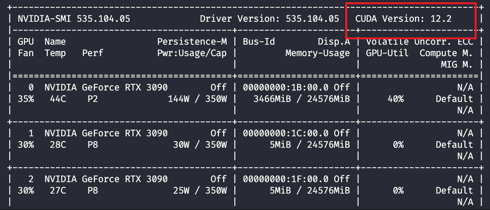
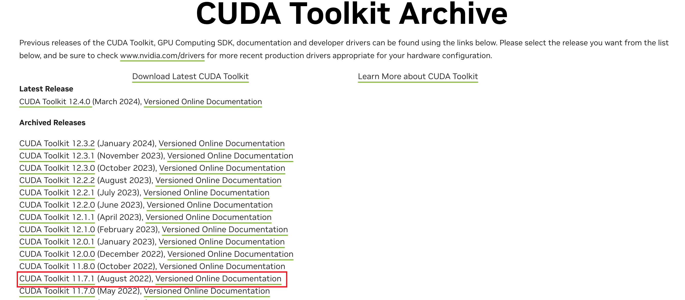
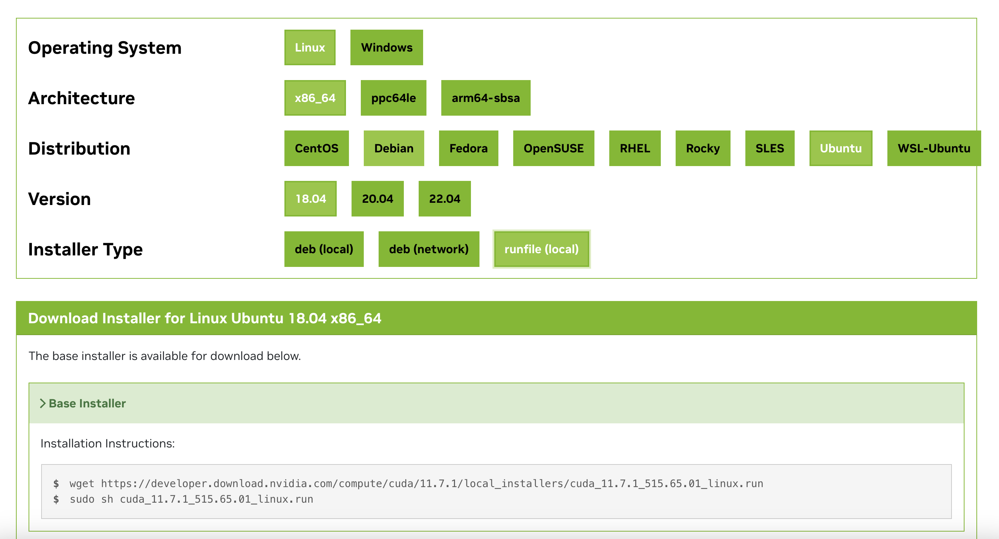
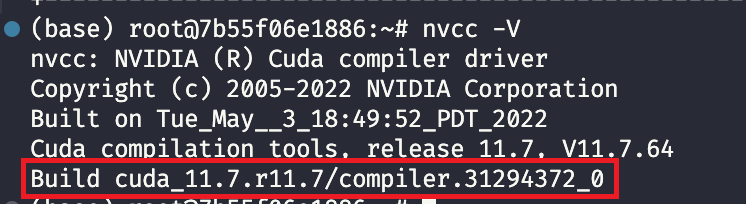
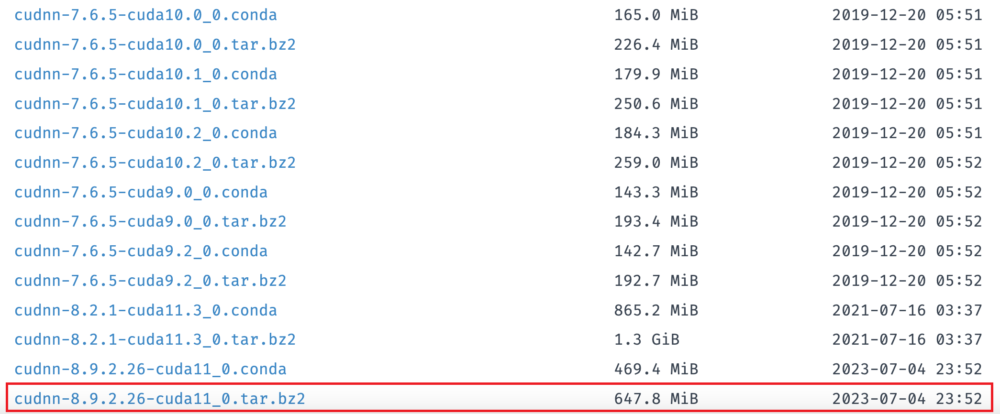
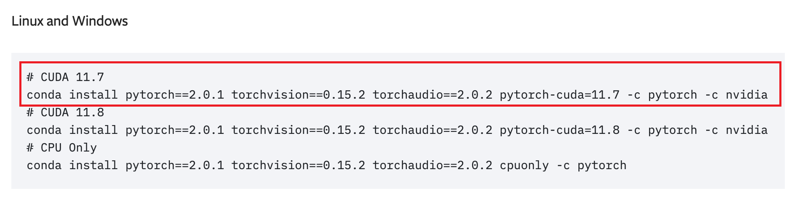

## Some Userful Websites
[Tsinghua Mirrors pip](https://mirrors.tuna.tsinghua.edu.cn/help/pypi/)\
[Pytorch Previous Version](https://pytorch.org/get-started/previous-versions/)
## GPU Enable for Pytorch
### Check Graphics Driver
First check if the **Graphics Driver** is installed:
```shell
nvidia-smi
```
If the installation is successful, the **CUDA Version** section should look like the following:

Please note that this is the **CUDA Driver** for the graphics card, next we will install the **CUDA Driver** for **Pytorch**.

### Install CUDA
Visit Nvidia's website:
[CUDA Toolkit Archive](https://developer.nvidia.com/cuda-toolkit-archive)

Choose the version of CUDA you want, here **CUDA-11.7** as an example:

After entering, select according to the architecture of your server, and use download method: **runfile(local)**.

Execute the two instructions in the diagram:
```shell
wget https://developer.download.nvidia.com/compute/cuda/11.7.1/local_installers/cuda_11.7.1_515.65.01_linux.run
sudo sh cuda_11.7.1_515.65.01_linux.run
```
Enter accept to confirm the installation. The option to install removes the **Driver**.

After installation, we need to configure environment variables in `.bashrc`.
```shell
sudo vim ~/.bashrc
```
Add the following at the end, be careful to change `cuda-11.7` to the name of the folder you get after installing it.
```bash
export PATH=$PATH:/usr/local/cuda-11.7/bin  
export LD_LIBRARY_PATH=$LD_LIBRARY_PATH:/usr/local/cuda-11.7/lib64  
export LIBRARY_PATH=$LIBRARY_PATH:/usr/local/cuda-11.7/lib64
```
Tests whether the installation is successful:
```shell
nvcc -V
```

### Install cuDNN
Next install **cuDNN**, go to visit [Tsinghua Mirrors](https://mirrors.tuna.tsinghua.edu.cn/anaconda/pkgs/main/linux-64/)

Choose **cudNN** version for **CUDA-11.x**. If you are using the CUDA-12 series, please go to the [Official Website](https://developer.nvidia.com/cudnn-downloads) to download manually.

Download **cuDNN** file to local:
```shell
wget https://mirrors.tuna.tsinghua.edu.cn/anaconda/pkgs/main/linux-64/cudnn-8.9.2.26-cuda11_0.tar.bz2
tar -jxvf cudnn-8.9.2.26-cuda11_0.tar.bz2
```
Copy the following files into the corresponding **CUDA** folder you just installed.
```
sudo cp include/cudnn*.h /usr/local/cuda-11.7/include 
sudo cp lib/libcudnn* /usr/local/cuda-11.7/lib64 
sudo chmod a+r /usr/local/cuda-11.7/include/cudnn*.h /usr/local/cuda-11.7/lib64/libcudnn*
```
Tests whether the copy is successful:
```shell
cat /usr/local/cuda/include/cudnn_version.h | grep CUDNN_MAJOR -A 2
```


### Install Pytorch
First create a new environment under conda:
```shell
conda create -n pytorchgpu python=3.9
```
Find the corresponding version of torch in [Pytorch Previous Versions](https://pytorch.org/get-started/previous-versions/).

Test if GPU is available for Pytorch:
```shell
python
import torch
torch.cuda.is_available()
```
