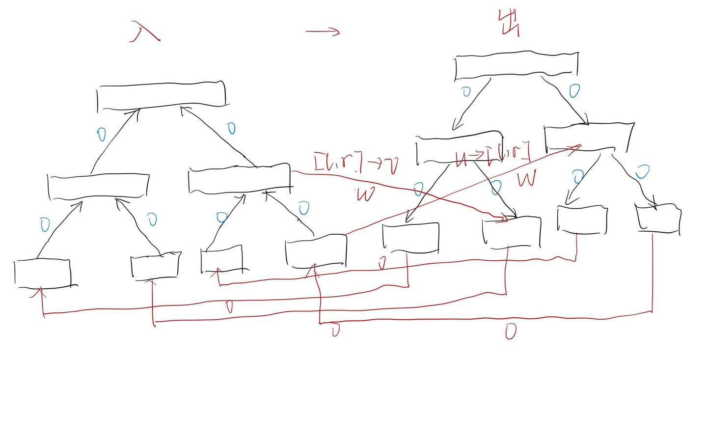

## 写在前面
> 此文是本人对于线段树的一些总结和归纳，在退役两年后再次重新系统的学习了一遍线段树，也有了一些新的感悟和体会，故在这里与各位分享，如果有错的地方希望各位加以指正，本文涉及的绝大多数例题都在文末给出了题目和代码链接，需要的可以自行查阅。

## 引入

线段树是算法竞赛中常用的维护区间信息的一种数据结构，其大多数能处理的情况一般为区间信息具有可并性，举例说明：

> 已知一个数列，有以下的两种操作：1.将区间 $[l,r]$ 中的数全部加上 $k$。2.查询区间 $[l,r]$ 所有数的和。

我们考虑一个区间 $[l,r]$ 的和其实就相当于 $[l,i]$ 的和加上 $(i,r]$ 的和（其中 $l \leq i \leq r$ ），这样我们询问一个区间的和就可以拆成询问两个子区间的和，这个也就是上文所说的**可并性**。

再举一个例子：

> 已知一个数列，有以下的两种操作：1.将某点 $p$ 的数修改为 $k$。2.查询区间 $[l,r]$ 最大的数是多少。

同理，我们有 $\max_{i=l}^{r} a_i=\max(\max_{i=l}^ka_i,\max_{i=k+1}^ra_i)$ ，我们可以同样的把原区间拆成两个子区间进行统计，我们发现最值运算同样具有**可并性**。

一般的，如果两个相邻区间信息能在常数的复杂度下通过某种运算合并成一个区间，那么我们就称这种运算具有**可并性**。

**可并性**可以给统计带来巨大的好处，我们考虑上述的两个问题，如果我们能够记录若干个区间的答案（比如能记录若干个形如 $(l,r)$ 的区间的最值），那么我们怎样去进行选择才能使得时空复杂度尽可能小，我们不难想到每一次将整个区间对半分是一种优秀的策略。

线段树就是这样的一种数据结构，其大致思想就是将一整个区间 $[1,n]$ 每次对半分成两个区间，一直分到区间长度为 1 为止，一般的，对于一个区间 $[l,r]$ ，我们会将其分为 $[l,mid]$ 和 $(mid,r]$ 两个区间。

## 性质
我们考虑线段树具有的一些性质：

线段树的高度的数量级为 $\log_2n$ ，这个根据我们对半分区间的做法可知，同样这使得我们对于一个单点进行改动所会影响的线段树中点数的数量级同样为 $\log_2n$。 我们定义 $f(l,r)$ 为我们所要维护的区间 $(l,r)$ 的信息，那么我们有 $f(l,r)=f(l,mid)\odot f(mid+1,r)$，其中我们定义运算 $\odot$ 为将两个区间的信息合并，我们考虑线段树上存在的点，如果 $\forall o \in \text{SegementTree}$ ，并且 $o$ 存在两个儿子 $ls,rs$ ，那么我们就有 $f(s(o))=f(s(ls))\odot f(s(rs))$，其中 $s(o)$ 表示 $o$ 所指的区间。 对于任意一个区间 $(l,r)$ 我们可以将其分为 $\log_2n$ 数量级个**线段树上存在**的区间，这个性质的证明等价于任意一个正整数可以被拆成若干个不等的形如 $2^i$ 的数之和，这也就意味着在线段树上进行 $n$ 次基本操作的时间复杂度以及线段树本身的空间复杂度都为 $\mathcal{O}(n\log_2n)$。

## 实现
一般我们会通过二进制的一个性质来实现线段树，我们规定 $\forall o \in \text{SegementTree}$，其左右儿子分别为 $o\ll 1,o \ll 1|1$，这也是线段树最简单的实现方式，我们也不难发现这种实现线段树的方式需要开 $4$ 倍的空间，还有一种动态开点的实现方法，其能严格保证空间的利用率，只需要线段树真正需要的 $2$ 倍空间即可，这也是可持久化线段树的基础，本文暂不涉及，感兴趣的读者可以自行进行查阅。

实现的细节具体可以看代码，下面给出区间加和区间查询的线段树代码进行参考：

[**代码实现**](https://paste.ubuntu.com/p/XsRgCbPxwz/)

## 懒惰标记

### 基本内容

最基本的线段树例题：

> 已知一个数列，有以下的两种操作：1.将区间 $[l,r]$ 中的数全部加上 $k$ 。2.查询区间 $[l,r]$ 所有数的和。

我们考虑建出的线段树的一个节点所需要维护哪些信息，首先我们需要维护某个节点所表示的区间的左右端点 $l[o],r[o]$，其次我们需要维护一个区间的和 $val[o]$。这样我们统计的时候只需要将所询问区间拆成若干个线段树上的区间即可，而找到这些区间的方法我们可以判断目前所在点的 $mid$ 相对于所求区间的位置进行讨论。

```cpp
ll SectionQuery(int x, int y, int o){
    if(t[o].l >= x && t[o].r <= y) return t[o].v;//如果某个点所表示的区间完全包含于所求区间以内，那么直接统计贡献
    PushLazyDown(o);
    int mid = (t[o].l + t[o].r) >> 1;
    ll res = 0;
    if(x <= mid) res += SectionQuery(x, y, ls);//如果mid以左还有包含于询问的区间，那么就继续往左走
    if(y > mid) res += SectionQuery(x, y, rs);//如果mid以右还有包含于询问的区间，那么就继续往右走
    Maintain(o);
    return res;
}
```

这样我们解决了询问的问题，但是我们发现修改的是一段区间，很显然我们不能每次修改线段树上的 $\log_2n$ 个点，但是我们知道修改区间同样也可以被拆成  $\log_2n$ 个区间，这样我们是否能够只对于这 $\log_2n$ 个区间进行修改呢？

答案是肯定的，我们在这里引入一个名叫 $lazy$ 的标记，这个标记产生的影响就是对于一整个区间进行该标记维护的操作，譬如在上述例子当中如果一个节点被打上了 $lazy$ 标记，那么就表示这一个区间都要要加上该标记所维护的数。

一般维护标记有两种做法，如果没有特殊说明，本文统一采取先产生影响后下传的顺序（换句话说，如果一个点被打上了标记，那么该点已经计算了该标记所产生的影响，该标记的价值在于对于其左右儿子产生影响）。

有了 $lazy$ 标记，我们就能很好的解决区间修改的问题，只要对于 $\log_2n$ 个包含于修改区间的线段树上的区间打上标记即可，而对于修改和查询到含有标记的结点时，我们就需要下传标记，这个我们就消除该点的标记，统计其左右儿子的贡献然后对于左右儿子打上标记即可。

我们考虑为什么可以使用打 $lazy$ 标记的方法，我们发现还需要具有的一个性质为对于**任意一个节点能在常数的复杂度内统计标记所产生的贡献**。

以上就是 $lazy$ 标记的基本内容，有了 $lazy$ 标记，我们就能很好的解决一些区间修改的问题。

### 拓展

考虑这样的一道题：

> 已知一个 $01$ 数列，有以下的两种操作：1.将区间 $[l,r]$ 中的所有数取反。2.查询区间 $[l,r]$ 所有数之和。

区间修改，区间查询不难想到可以用带标记的线段树进行维护，那我们考虑我们该如何设计这个标记。

不难发现最简单的方法就是将标记的内涵设计为 $reverse$ ，也就是将整个区间取反，我们考虑如果一个区间存在这样的一个标记，我们假定其原来的答案为 $val[o]$，那么该标记对于答案造成的影响就是 $val[o]\rightarrow len[o]-val[o]$（其中 $len[o]$ 是区间的长度），可以 $\mathcal{O}(1)$ 进行维护。

我们考虑 $lazy$ 标记本质上就是将本应下放到每个结点的影响暂时贮存在从上至下第一次被完全包含的若干个区间中，如果我们假设结点 $o$ 存在一个标记，那么只有在需要询问 $o$ 的后代时才需要下传标记，从而使得单次区间修改的时间复杂度同样为 $\mathcal{O}(\log_2n)$。

### 多标记间的相互影响

考虑这样的一道题：

> 已知一个数列，有以下的三种操作：1.将区间 $[l,r]$ 中所有数乘上 $k$ 。2.将区间 $[l,r]$ 中所有数加上 $k$ 。3.查询区间 $[l,r]$ 中所有数之和。

如果将操作 $1,2$ 分别拆开，发现都可以使用打标记的方法进行解决，但是两种标记之间是否会相互影响，答案是肯定的，那么我们就必须要规定一种标准的处理标记的顺序。

我们规定优先进行乘法标记的的下传，原因会在后面给出。

我们考虑下传一个乘法标记会对那些量产生影响，首先是区间的答案，其次会对于后代的乘法标记产生影响，但除此以外我们发现如果一个节点 $o$ 存在一个乘法标记，而且其儿子存在一个加法标记，那么这个本质上就相当于在进行区间乘之前就进行了区间加的操作，这样后代的加法标记也需要乘以乘法标记，这个也就是多标记之间的相互影响，基本代码实现如下：

```cpp
void push_down(int k)
{
    tree[ls].v = (tree[k].m * tree[ls].v % p + (tree[ls].r - tree[ls].l + 1) * tree[k].a % p) % p;
    tree[rs].v = (tree[k].m * tree[rs].v % p + (tree[rs].r - tree[rs].l + 1) * tree[k].a % p) % p;
    tree[ls].m = tree[ls].m * tree[k].m % p;
    tree[rs].m = tree[rs].m * tree[k].m % p;
    tree[ls].a = (tree[ls].a * tree[k].m % p + tree[k].a) % p;
    tree[rs].a = (tree[rs].a * tree[k].m % p + tree[k].a) % p;
    tree[k].m = 1, tree[k].a = 0;
}
```

现在我们给出这种处理顺序的原因，我们考虑如果优先处理加法标记的话，假设 $\exists o\in \text{SegementTree}$，其中  同时有加法标记和乘法标记，那当下传标记统计后代答案时，我们列出的式子就会是 $(x +\frac{tag_{add}}{tag_{mul}})\times tag_{mul}$ ，这就会出现除法操作，如果是不带取模的运算就需要进行小数运算，不难发现会大量丢失精度，因而我们采取优先处理乘法标记的原则。

## 应用

### 非常规标记

> 对于两个数组 $a,b$ ，长度均为 $n$ ，有以下的两种操作：1.将 $a$ 中从 $x$ 开始的连续 $k$ 个元素覆盖掉 $b$ 中从 $y$ 开始的连续 $k$ 个元素。2.求 $b_x$ 的值。

一般我们认为标记的作用在于暂时储存未下放到全部子树的信息，此题给了我们一个新的启示：

考虑对于区间赋值不同的数是无法使用一般标记进行维护的，但是我们知道其一定是 $b$ 中连续的一段，这样我们发现如果进行了一次操作一，那么 $\forall0\leq i < k$ ，都有 $a_{x+i}=b_{y+i}$，那么我们实际上只需要区间赋值 $\Delta (x-y)$ 即可，这样我们只需要使用一个标记去记录某个区间是否被赋值即可。

个人认为标记是线段树的精髓，其最大好处就是可以将本应落实到每个结点的信息暂时推迟，只有等到我们需要使用该节点的后代的时候才会进行下传，这样我们可以保证每次操作和查询的复杂度，本题也拓宽了我们对于标记的理解，其用途具有多样性。

### 权值线段树

**基本内容**

> 统计一个数列中逆序对的个数。

该问题也被称为逆序对问题，相信各位读者在初次学习归并排序时就应该接触过，不过这里我们考虑如何使用数据结构的方法来进行统计。

首先明确我们所求为满足 $i<j,a_i>a_j$ 的二元组 $(i,j)$ 的数目，那么我们可以考虑统计每个 $j$ ，满足条件的 $i$ 的数目有多少。

我们假设数列 $a$ 中所有的数都在 $[1,n]$ 以内，那么我们考虑从小到大枚举 $j$ ，并且将 $\forall i<j$ 的 $i$ 插入到线段树的 $a_i$ 位置上，那么对于 $j$ ，所有满足条件的 $i$ 就是插入线段树中的数中小于 $a_j$ 的的数有多少个，我们将插入的数的权值赋值为 $1$ ，那么我们实际上就是统计区间和，而这颗线段树也就叫做权值线段树。

**拓展**

> 有 $n$ 个三元组 $(a_i,b_i,c_i)$ ，统计有多少个三元组的 $(a_i,b_i,c_i)$ 均小于某个三元组。

乍一看像三维偏序问题，实际上不是，我们考虑首先按照 $a$ 从大到小进行枚举，这样我们实际上就消除了第一维的限制，对于剩下的两维，我们可以以第二维为坐标插入第三维的值，这样我们假设枚举到 $j$ ，将所有枚举过的三元组按上述方法插入到线段树中，这样我们实际上就是找 $(b_j,MAX)$ 区间中是否存在 $c_i>c_j$ ，故维护区间最大值即可，需要离散化。

这实际上就是权值线段树的一种扩展，可以将其看作是一种思想进行理解，就是线段树不仅可以按原序列的区间来维护，在一些非区间问题中也可以利用线段树配合离散化来消除两维的限制进行解决。

### 与异或有关的一类区间问题

**基本例题**

> 已知一个数列，有以下的两种操作：1.将区间 $[l,r]$ 中所有的数同时异或 $c$ 。2.求区间 $[l,r]$ 中所有数之和。 **注：数列中的数和** $c$ **都不超过** $10^6$ **。**

看到区间修改和区间查询，我们不难想到去打标记来解决这个问题，但是我们发现无法在常数的复杂度内快速统计一段区间异或一个数后其总和的变化。

我们发现了任何时刻数列中的数的数量级都在 $10^6$ ，再加上异或操作的特殊性，可以考虑将数二进制分解，这样每一位之间就都是独立而不相互影响的。

换句话说就是我们考虑建出 $\log_2(10^6)$ 个线段树，分别去维护每一位，这样假设我们将区间 $[l,r]$ 里的所有数都异或 $c$ ，实际上就是将 $c$ 也拆成二进制位，对于第 $k$ 位，如果 $c$ 的二进制位下这一位为 $1$ ，那么其实就相当于对于第  位所表示的线段树的 $[l,r]$ 区间进行 $01$ 翻转，否则就不变。

最后统计答案只要对于第 $k$ 棵线段树 $(0 \leq k <21)$ 乘以其底数 $2^k$ 即可。

本题给了我们一个解题的新思路：对于一类区间异或问题，如果不好快速统计修改造成的影响，我们可以考虑将其二进制分解来进行考虑，对于每一个二进制位建出线段树，从而简化线段树的维护方式。这一类问题也一般会有明确的数据范围的缩小来使得线段树的空间复杂度能够承受。

**拓展**

> 已知一个数列，有以下的两种操作：1.单点修改某一位的数。2.求区间 $[l,r]$ 所有子区间 $[l',r'] \subset [l,r]$ 的异或和之和，即 $\sum a_{l'} \oplus a_{l'+1} \oplus ... \oplus a_{r'}$ 。 **注：数列中的数不超过** $1000$ **。**

单点修改，看起来比较好进行维护，那么难点就落在了统计上，之前我们遇到的都是统计一段区间 $[l,r]$ 的某些信息，但是本题需要统计的是其所有子区间的信息。

根据子区间的性质，我们发现统计所有子区间的复杂度是已经是 $\mathcal{O}(n^2)$ 的，很显然已经超出了我们能接受的范围。

考虑有哪些特殊性质，我们发现数列中的数都不超过 $1000$ 并且进行的是异或统计，我们就不难想到二进制分解，考虑对于每一个二进制位开一个线段树，这样我们首先考虑每一位的情况。

问题就转化成了一个数列中只有 $0,1$ ，每次询问一段区间 $[l,r]$ 的所有子区间中异或起来为 $1$ 的区间有多少个，就转化成了一个经典问题，解决方法也是比较套路的。

考虑使用线段树维护以下几个东西：

$d$ 表示区间异或和，$s_0,s_1$ 表示异或和为 $0/1$ 的子区间有多少个，$l_0,l_1$  表示从左端点开始异或和为 $0/1$ 的子区间有多少个，$r_0,r_1$  表示从右端点开始异或和为 $0/1$ 的子区间有多少个。

对于如何合并子树，我们假设目前处理到了点 $o$ ，它分别有后代 $ls,rs$ ，就有：

$$s_{o,1}=s_{ls,1}+s_{rs,1}+r_{ls,0}\times l_{rs,1}+r_{ls,1}\times l_{rs,0} \newline s_{o,1}=s_{ls,1}+s_{rs,1}+r_{ls,0}\times l_{rs,1}+r_{ls,1}\times l_{rs,0} \newline l_{o,1}=l_{ls,1}+l_{rs,d_{ls}\otimes 1} \newline r_{o,1}=r_{rs,1}+r_{ls,d_{rs}\otimes1}$$

修改就修改叶子节点然后逐层传递上去即可，统计答案方式与上题同理。

### 与 DFS 序有关的一类树上问题

**维护子树**

> 给定一个 $n$ 个结点的有根树，每个节点的权值只为 $0/1$ ，有以下的两种操作：1.将 $u$ 的子树内的所有结点的权值全部取反。2.统计 $u$ 的子树内的权值和。

通过 DFS 序，我们可以很好的将一个树上问题转换成序列问题，具体的说，我们考虑利用 DFS 序去建立一颗线段树，那么一个子树的 DFS 序一定是一段连续的区间。

这样我们就将原问题转化为了区间取反以及区间求和，解决方法在上文中已经提及过。

**维护点到根的路径**

> 给定一个 $n$ 个结点的有根树，有以下的三种操作：1.将 $u$ 结点的权值增加 $z$ 。2.将 $u$ 结点的子树内的每个结点的权值增加 $z$ 。3.询问 $u$ 结点到根节点的路径中所有点的点权和。

看到的第一眼可能想到的都是树剖，但实际上我们对通过DFS序的建树的过程进行一定的调整就可以解决。

考虑树上到根节点的一条路径并非是线段树中连续的一段，但是我们考虑当我们DFS进入或者离开某个节点时都作为线段树上的一个节点，这样我们对于进入的结点的值赋为正值，离开的结点的值赋为负值，这样我们发现中间的部分就相互抵消了，问题就得到了解决。

现在我们考虑如果进行修改，发现操作一其实就是两个单点操作，操作二就是一个区间操作，那这样我们其实只需要考虑如何进行区间操作即可。

我们考虑这个实际上是一个特殊的区间加法，考虑一个标记 $lazy$ 会对于一个区间产生怎样的影响，不难发现这与这段区间内有多少个入点和出点有关，所以我们只要将入点赋值为 $1$ ，将出点赋值为 $-1$，那么影响就是 $z\times \triangle num$ ，其中 $num$ 为入点数减去出点数，按照这种方式下传标记即可。

本题告诉了我们通过对 DFS 序加以转化为 IN/OUT 序就可以维护某点到根的路径，有时候可以大大的简化需要使用的数据结构。

**拓展**

> 给定一个 $n$ 个结点的有根树，每个点有权值 $w_i$ ，要求选出 $k$ 条从根节点到叶子节点的路径，使得这些路径并起来的价值和最大。

我们不难想出这样的一种贪心算法，每次取一条价值和最大的到根的路径，然后删去该路径上所有的权值，考虑如何去实现。

首先如果一个点被删过了，那么它的所有直系祖先（也就是其到根节点简单路径上的所有点）都会被删过，这样我们如果遇到删过的点就直接跳过就行，考虑每个点只会被删去一次，那么这样是 $\mathcal{O}(n)$ 的。

问题就来到了每次如何快速找到起始的叶子节点，我们考虑维护每个结点到根节点路径的权值和，每次就是找出权值和最大的那个点，这样我们如果删去了一个点，那么只会对该点子树产生影响，因此我们根据 DFS 序来维护 $sum$ 的线段树即可，由于要找到该点的位置，我们还需要同时记录最大值出现的位置，打标记维护即可，复杂度 $\mathcal{O}((n+k)\log_2n)$。

我们其实可以看出来上述做法实际上就是一种暴力，通过使用数据结构进行维护，我们有时可以降低暴力的复杂度使之能够通过较大的数据范围。

### 有效操作次数有限的一类序列问题

**基本例题**

> 已知一个数列，有以下的两种操作：1.将区间 $[l,r]$ 中的所有数 $a_x$ 修改为 $\lfloor{ \sqrt{a_x} }\rfloor$ 。2.查询区间 $[l,r]$ 所有数的和。

考虑到一个数开根号后取整若干次就会变成 $1$ ，发现这个次数 $p$ 不会很大，这样如果线段树上的一段全部为 $1$ 那么我们就打上标记即可，可以证明复杂度是 $\mathcal{O}(n(p+\log_2n))$ 的。

我们考虑另外一种思路，记录一个区间的最大值和最小值，如果一个区间的最大值和最小值开根相同，那么我们就打上区间覆盖标记，否则我们暴力的往下更新，这样的复杂度也是正确的。

我们可以考虑每对于区间进行一次操作，区间内一定会存在两个相邻的数使得他们的差减小，而开根号减小次数是 $\log_2 n$ 级别的，在线段树上最多会走 $\log_2 n$ 步，所以复杂度是 $\mathcal{O}(n\log^2n)$ 的。

虽然这种做法的复杂度看上去不是那么优秀，但是这种通过最大最小值来解决问题的思想在算法竞赛中经常会用到，而且这种复杂度分析的方法也给我们提供了一种新的思路。

**拓展**

> 已知一个数列，有以下的三种操作：1.将区间 $[l,r]$ 中的所有数 $a_x$ 修改为 $\lfloor{ \sqrt{a_x} }\rfloor$。2.查询区间 $[l,r]$ 所有数的和。3.将区间 $[l,r]$ 中的所有数 $a_x$ 加上 $y$。

我们发现这道题如果使用上面的第一种方法复杂度是错误的，发现这道题并不是很好维护。

我们还是考虑记录一个区间的最大值和最小值，如果一个区间的最大值和最小值开根相同，那么我们就打上区间覆盖标记，否则我们暴力的往下更新，但是我们考虑这样的一种情况： $a=(1,2,1,2,...,2)$，每次我们将整体 $+2$ 再整体开根，发现复杂度显然为 $\mathcal{O}(n^2)$ 。

考虑排除掉这种特殊情况，我们对于 $Max-Min \leq 1$ 的情况进行维护，其余的往下递归去更新。

如果 $Max=Min$，那么区间内的数都一样，相当于区间减法。

如果 $Max=Min+1$，当 $\sqrt{Max}=\sqrt{Min}$ 的时候，相当于区间赋值，当 $\sqrt{Max}=\sqrt{Min}+1$ 时，由于 $Max-\sqrt{Max}=Min-\sqrt{Min}$ ，相当于区间减法。

感觉只是排除了这种特殊情况，但实际上复杂度是正确的，我们还是考虑每对于区间进行一次操作，区间内一定会存在两个相邻的数使得他们的差减小，当我们排除了上述这种特殊情况后，区间加法最多只会改变两个相邻的数的差值，而开根号减小次数是 $\log_2n$ 级别的，并且在线段树上最多会走 $\log_2n$ 步，所以复杂度是 $\mathcal{O}(n\log^2n)$ 的。

对于两个标记的问题，我们发现上述做法区间赋值是优于区间加减的，这也是为什么当 $Max=Min$ 的时候我们考虑的是区间减法而不是区间赋值，实现有一些小技巧，详情见代码。

### Segement Tree Beats！

暂时留坑待填。
Update on 2024：坑两年了，还没填（

### 线段树维护DP

> 给定一个序列 $a$ ，定义一种操作为读取序列中的一个数 $x$ ，然后读取序列中的 $x$ 个数，重复这种操作如果能恰好读取完整个序列，那么我们称这是一个合法序列，求将给定序列 $a$ 变为合法序列 $b$ 的最小代价，最小代价定义为 $\sum_{i}|a_i-b_i|$ 。

考虑正向不是很好处理，我们考虑 $f_i$ 表示使得从 $i\sim n$ 的序列合法的最小代价，那么我们就有转移 $f_i=\min(f_j+|a_i-(j-i-1)|)$。发现这个与 $a_i$ 和 $j-i-1$ 的相对大小有关，考虑分类讨论：

$a_i>j-i-1$ 时，有 $f_i=\min(f_j-j)+a_i+i+1$ 

$a_i<j-i-1$ 时，有 $f_i=\min(f_j+j)-a_i-i-1$ 

这两种情况是序列上相邻的两段，考虑分别用线段树维护 $f_j-j,f_j+j$ 的最小值即可，本题标程做法并非数据结构，因此题目比较卡常，建议去 vjudge 上提交。

> 给定二维平面上的 $n$ 个点，现取出若干个点按 $x$ 坐标排序顺次连接，将会构成一些连续上升或下降的折线，给定 $k$ ，求选取的点数为 $k$ 的时候共有多少种不同的选点集合。

考虑最朴素的 DP，$f_{i,j,0/1}$ 表示以第 $i$ 个点结尾，目前划分出了 $j$ 段，最后一段为一个上升/下降折线的方案数，有转移：

 $$f_{i,j,0}=\sum_{k=1}^{i-1}(f_{k,j,0}+f_{k,j-1,1})\times [y_k>y_i] \newline f_{i,j,1}=\sum_{k=1}^{i-1}(f_{k,j,1}+f_{k,j-1,0})\times [y_k<y_i]$$

发现当 DP 的后两个参数固定时，前一项就是满足 $[y_k >/< y_i]$ 限制的权值和，这样我们开 $2k$ 个权值线段树维护即可。

> 给定一个序列 $h$ ，求一个最长子序列满足子序列中任意相邻两项 $i,i+1$ ，都有 $|h_i-h_{i+1}|\geq d$。

考虑最朴素的 DP ，$f_i$  表示以 $i$ 为结尾最长的子序列长度为多少，我们有 $f_i=\max(f_j)+1~\text{iff}~|h_i-h_j| \geq d$，这个限制等价于 $(h_j \leq h_i-d)\cup(h_j\geq h_i+d)$ ，发现是连续的两段，这样我们考虑建出权值线段树，然后在线段树上二分找到这两个区间查询 $f$ 的最大值即可，由于 $h_i$ 范围较大，需要进行离散化。

**总结**

不难发现线段树维护 DP 的一般情况是转移方程从一段连续的区间转移到某个点，这样我们通过将之前的答案插入到权值线段树就可以 $\log_2n$ 复杂度的进行转移。

### 线段树优化最短路

> 有 $n$ 个点，$q$  条以下三种形式的路径：1. $u\rightarrow v$ ，费用为 $w$。2. $u \rightarrow [l,r]$，费用为 $w$。2. $[l,r]\rightarrow v$，费用为 $w$。求点 $s$ 到其他点的最短路。

考虑如何去处理，如果我们朴素的对于每个 $i \in [l,r]$ ，都向 $v$ 连一条边，那这样边数是 $n\times q$ 级别的，很显然不能接受，而对于这一类问题，我们有一种比较套路的建模方式：



其大致思想就是将区间拆分成 $\log_2n$ 个线段树上的区间，通过一个表示入点和一个表示出点的线段树来等价原先冗杂的建边方式，我们对于这个图跑单源最短路即可。

> 有 $n$ 个点，$m$ 条路径，每条路径的形式为 $[l_1,r_1] \leftrightarrow [l_2,r_2]$，费用为 $1$ ，求 $s$ 到其他点的最短路。

大致思路与上题相同，不过我们需要考虑如何处理区间到区间的边。

首先可以把双向边拆成两个单向边，我们考虑如果处理一条路径 $[l_1,r_1] \rightarrow [l_2,r_2]$，不难发现可以对于每条边额外建立两个点 $p_1,p_2$，对于 $[l_1,r_1]$ 分成的区间向 $p_1$ 连 $0$ 边，$p_1$ 向 $p_2$ 连 $1$ 边，然后 $p_2$ 向 $[l_2,r_2]$ 分成的区间连 $0$ 边，正确性不难证明。

然后跑最短路即可，本题比较卡常，在加了一堆优化才勉强通过，可能是边权只有 $0/1$ 的最短路问题有一些小技巧，这里没有去深究。

## 结语

本文从线段树的基础开始讲起，例举了线段树的多个应用场景，希望能给读者带来一些启发，完结撒花，感谢阅读。

## 题目链接
[题目链接合集](https://zhuanlan.zhihu.com/p/537536325)